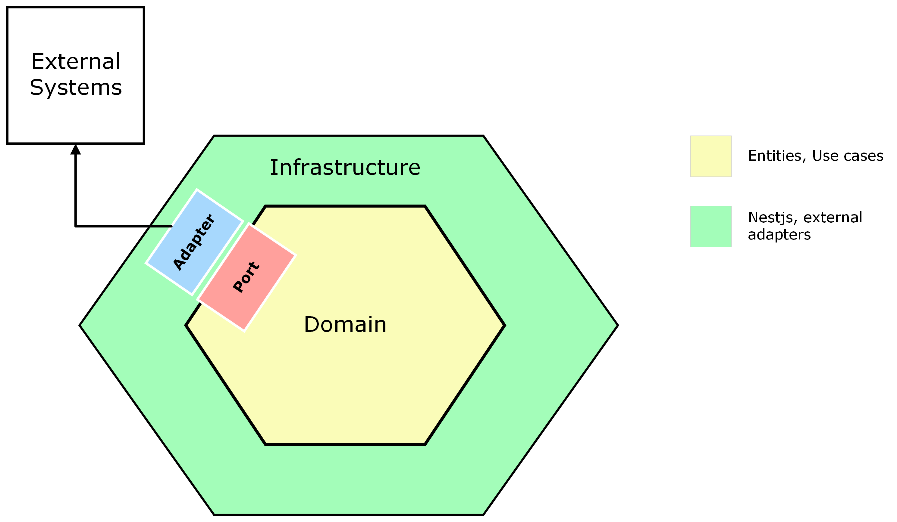

# Aguas San isidro typescript-hexagonal

## Index

- [Aguas San isidro typescript-hexagonal](#Aguas San isidro typescript-hexagonal)
  - [Index](#index)
  - [Architecture](#architecture)
  - [Branching Model](#branching-model)
    - [How to name branches?](#how-to-name-branches)
    - [Creating and merging branches](#creating-and-merging-branches)
  - [Approval process Pull Request](#approval-process-pull-request)
  - [Code review process](#code-review-process)
  - [Launch project with docker](#launch-project-with-docker)
  - [Launch project without docker](#launch-project-without-docker)
  - [Run test with docker](#run-test-with-docker)
  - [Launch project with serverless](#launch-project-with-serverless)

## Architecture

This project uses hexagonal architecture and implements it as the image shows.

At the core of the project is the [domain](src/domain) where the entities, the ports (these are interfaces which will later be implemented by the infrastructure layer adapters) and use cases with their respective business rules are found.

In the [infrastructure layer](src/infrastructure/) we use the [NestJs](https://nestjs.com/) framework through which adapters are implemented that are injected into the domain so that it can perform its functions by connecting with external systems and exposing an api to our clients.
